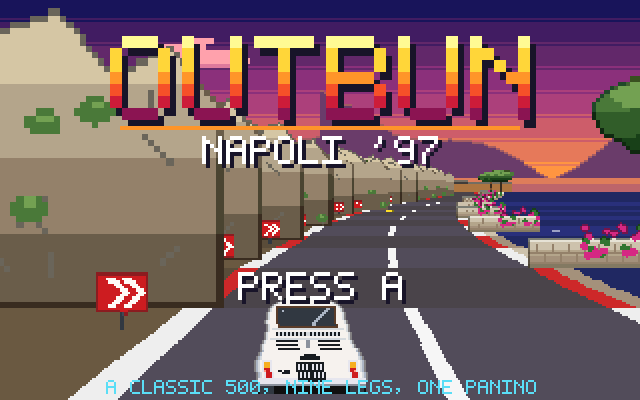
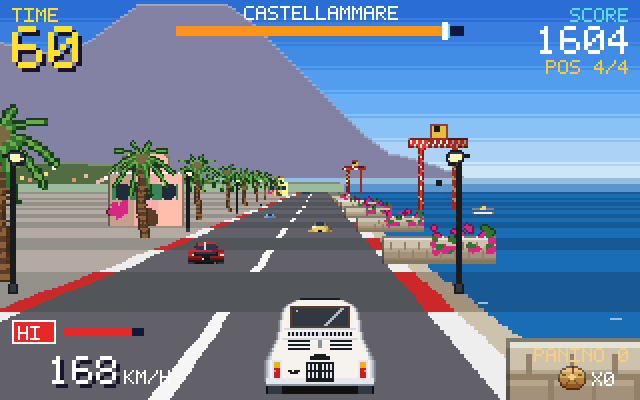
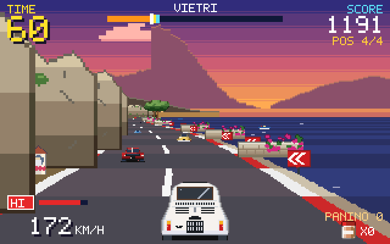
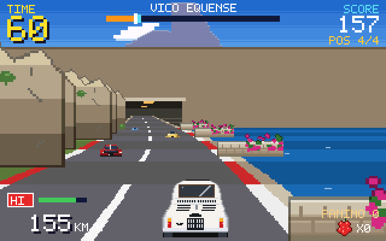
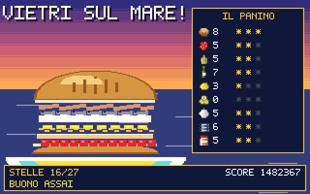

# OutBun — Napoli '97

> 1997, around Naples: the quest for a bun sandwich on the rocky shores of the Sorrento and Amalfi Coasts is merely an excuse to put the pedal to the metal in a souped-up classic white Fiat 500 — racing through an OutRun-inspired arcade adventure.



**OutBun-napoli97** is a PRG32 portable cartridge for 1–4 players: a pseudo-3D arcade racer on the real 1997 coast road from **Napoli** to **Vietri sul Mare**, around the Sorrento peninsula and down the Amalfi coast. Every leg ends in a real town and hides a local ingredient: collect them all to stack the best *panino* in a rosetta bun in all of Campania.

| | |
|---|---|
|  |  |
|  |  |

## The journey

Nine timed legs, one continuous drive. Each checkpoint adds time (*extended time*), changes the light — morning over Vesuvius, golden afternoon at Positano, sunset over the Gulf of Salerno — and asks for a new ingredient:

| Leg | Road | To | Real km | Ingredient |
|---|---|---|---:|---|
| 1 | SS18 Vesuvian coast | Castellammare di Stabia | 30 | Pane rosetta |
| 2 | SS145 Sorrentina | Vico Equense | 10 | Pomodorino del Piennolo |
| 3 | SS145 (Ponte di Seiano) | Meta di Sorrento | 8 | Provolone del Monaco |
| 4 | SS145 | Sorrento | 5 | Olio extravergine |
| 5 | Via Capo, Massa Lubrense | Nerano | 14 | Limone di Sorrento |
| 6 | Sant'Agata, SS163 | Positano | 20 | Zucchine alla Nerano |
| 7 | SS163 Amalfitana (Furore) | Amalfi | 17 | Fior di latte di Agerola |
| 8 | SS163 (Capo d'Orso) | Cetara | 13 | Alici di Cetara |
| 9 | SS163 | Vietri sul Mare | 5 | Tonno di Cetara |

The route is described section by section in [`src/route.h`](src/route.h) and explained in [docs/ROUTE.md](docs/ROUTE.md): the galleria di Pozzano and the other SS145 tunnels, the high Seiano viaduct, the Punta Scutolo bend, the tornanti down to Nerano and Positano, the Fiordo di Furore bridge, the Saracen towers and the majolica domes — with Vesuvius, Capri, Ischia, Li Galli and the Salerno coast on the horizon where you would really see them.

## Cars

The hero car is a **white Fiat 500 L**; its sprite is placed pixel by pixel from photographs of a real 1968–72 car: soft-top, slatted grille, louvred engine lid, plate-light hump, tall amber-over-red lamps and the "500 L" script. The other players — and the CPU rivals when fewer than four humans play — drive the other souped-up classics: **Fiat 126**, **Citroën Dyane** and **VW Maggiolino (Beetle)**. Each has its own top speed, acceleration and grip. The road is shared with Piaggio Apes full of lemons, Vespas and the blue SITA coach.

## Controls

| Button | Menus | Race |
|---|---|---|
| A | Confirm | Accelerate |
| B | Back | Brake |
| LEFT / RIGHT | Choose | Steer |
| UP / DOWN | Choose | Shift HI / LO gear |
| START | — | Pause |

Start in **LO** and shift to **HI** past ~110 km/h, like the arcade original. Hairpins throw you outwards: lift or brake, or kiss the stone parapet. The golden items are worth three.

## Multiplayer

Choose **NETWORK** on the mode screen. Consoles running the same cartridge meet in the `outbun-napoli97:v1` room of the PRG32 [MultiplayerServer](https://github.com/riscv-prg32/MultiplayerServer). The lobby lists up to four players; press A to be ready and the race starts when everyone is. CPU drivers take the free cars, and take over a player who disconnects. B leaves the room and races the CPU. Everybody publishes position, speed, lean, brake lights and panino count, so rival cars, their dots on the progress bar and the final *classifica* are shared. Each console collects its own ingredients.

Requirements: Wi-Fi station mode with `PRG32_MULTIPLAYER_SERVER_URL` configured in the firmware, the MultiplayerServer reachable on the LAN, and the same cartridge version on every console. In QEMU the multiplayer stub has no peers: the lobby waits, and B starts a CPU race.

## Scores

At the end the panino is assembled layer by layer on a Vietri majolica plate and rated from *che tristezza* to *il migliore della Campania!* (27 stars). The score — distance, ingredients, time left, finishing position and stars — goes to the firmware's persistent top five with `prg32_score_submit_current_player`, and is synced to a configured Cartridge Store.

## Build

Requirements: Python 3 with Pillow (`pip install -r requirements-dev.txt`), a C compiler for the host tests, a current [PRG32](https://github.com/riscv-prg32/PRG32) checkout and its ESP-IDF RISC-V toolchain.

```sh
make test                                   # assets, source checks, host harness
PRG32_ROOT=/path/to/PRG32 \
CARTRIDGE_STORE_ROOT=/path/to/CartridgeStore \
./build.sh                                  # cartridges + Store bundle
```

`build.sh` regenerates assets and music, runs the checks and the harness, renders the screenshots, builds a portable multiplayer cartridge with its AUDIO block, attaches metadata for `esp32c6` and `qemu`, packs `dist/OutBun-napoli97-<version>-store.zip`, rejects any image over **65,536 bytes**, and — with `CARTRIDGE_STORE_ROOT` set — runs the Cartridge Store's own intake code on the bundle.

To try it in QEMU, stage the cartridge from the PRG32 root (the adapter supplies the 64 KiB RAM fallback, see [docs/TECHNICAL_NOTES.md](docs/TECHNICAL_NOTES.md)):

```sh
python3 /path/to/Outbun-napoli97/tools/prg32_cli_64.py qemu upload /path/to/Outbun-napoli97/dist/store/OutBun-napoli97-qemu.prg32
python3 -m prg32 qemu run
```

## Cartridge Store bundle

The ready-to-publish bundle is committed in [`dist/`](dist/):

- `dist/OutBun-napoli97-1.0.0-store.zip` — manifest, icon, screenshot and both architecture variants
- `dist/store/` — the unpacked bundle
- `dist/SHA256SUMS` — checksums

Publish it with `python3 -m prg32 store publish-bundle dist/OutBun-napoli97-1.0.0-store.zip` against your Store.

## Budget

| | bytes |
|---|---:|
| code, tables and sprites (portable ABI image) | 43,400 |
| AUDIO block (6 tracks, 8 procedural voices) | 2,496 |
| header, metadata, colophon, icon, screenshot | 8,568 |
| **cartridge** | **54,464 / 65,536** |

The executable image uses 48,452 bytes of the 64 KiB cartridge RAM. Real-firmware QEMU captures are in [`release-artifacts/qemu/`](release-artifacts/qemu/). [docs/TECHNICAL_NOTES.md](docs/TECHNICAL_NOTES.md) explains how the art fits: a programmed 213-colour palette, row-group nibble-RLE sprites and procedural panoramas.

## Documentation

- [docs/GAME_DESIGN.md](docs/GAME_DESIGN.md) — rules, scoring, balancing
- [docs/ROUTE.md](docs/ROUTE.md) — the real road, leg by leg
- [docs/TECHNICAL_NOTES.md](docs/TECHNICAL_NOTES.md) — renderer, assets, audio, network, testing
- [CHANGELOG.md](CHANGELOG.md), [RELEASE_CHECKLIST.md](RELEASE_CHECKLIST.md)

## Notice

A fictional race on real roads. Fiat, Citroën, Volkswagen, Piaggio and SITA are named descriptively as period vehicles; no logos or trademarks are reproduced and no affiliation is implied. The real SS145 and SS163 are narrow and busy — drive them gently. MIT licensed.
